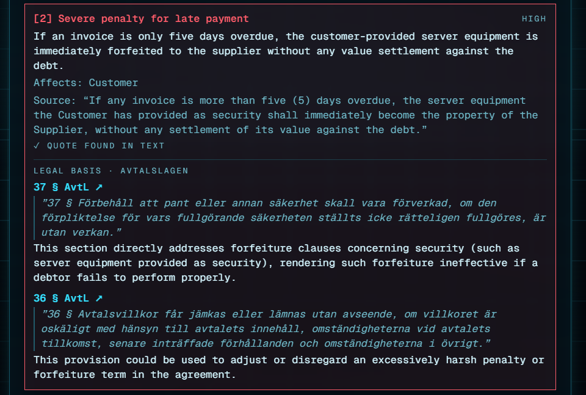
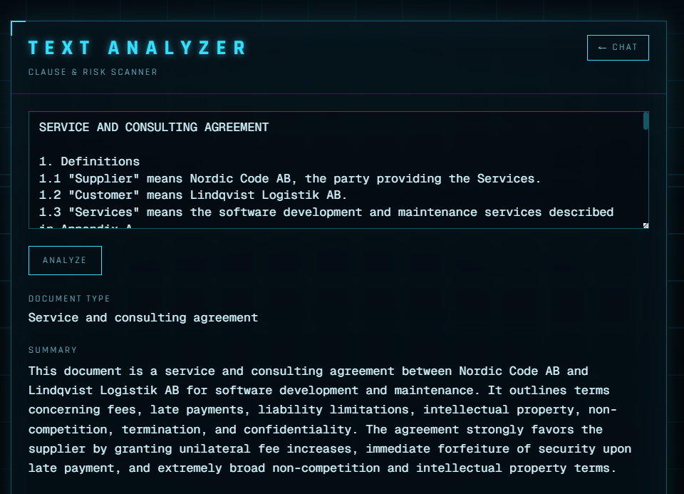
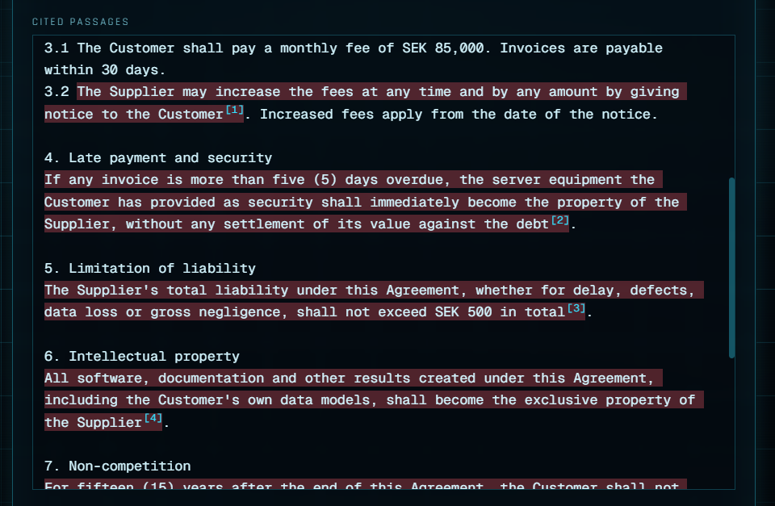

# Legal AI Text Analyzer

[](https://github.com/Nabras03/Legal-ai-analyzer/actions/workflows/ci.yml)

A full-stack demo that uses Google's Gemini model to analyze legal text. Paste in a clause or document and it flags risky terms, extracts defined terms, and summarizes the content — returning structured JSON instead of a wall of prose, so the frontend can render it as data (risk badges, a definitions list, citations) rather than just displaying raw model text.

Built as a learning project to practice full-stack LLM integration: prompt design, enforcing a strict JSON contract on model output, and checking the model's claims against the source text instead of trusting them.

**Live demo: [legal-ai-analyzer-one.vercel.app/analyze](https://legal-ai-analyzer-one.vercel.app/analyze)** (the backend runs on a free plan and sleeps when idle, so the first analysis can take up to a minute)



> **Disclaimer:** This is a portfolio/learning project, not a legal tool. It does not give legal advice and its output should not be relied on for real legal decisions.

## How this was built

I'm a law student, not a software engineer. The code in this repository was written by Claude Code (Anthropic's AI coding assistant), working under my direction. The project is part of a self-directed learning path from law student to legal AI builder, where each step is a legal problem used to learn a new AI technique: structured output on contract clauses, RAG on statutes, and evaluation of legal accuracy.

**My role:**
- **Direction and scope:** I decided step by step what to build next and how the system should be structured: a separate FastAPI backend, structured JSON instead of free text, grounding in Avtalslagen, and a measurable evaluation. Claude Code proposed the implementation details and wrote the code.
- **Legal judgement:** I chose the legal sources and reviewed the evaluation labels. That review mattered: the initial labels treated 36 § as inapplicable to four clauses, I judged that it can apply, and correcting the labels showed the model had been right. Tuning the prompt against the original labels would have made it worse.
- **Decisions and trade-offs:** model choice under free-tier quotas, abuse limits for the public demo, and what to keep or cut.
- **Testing and deployment:** testing the app against example contracts, and deploying it on Render and Vercel.

What I'm practising is the work a legal AI system needs from a lawyer: specifying it precisely, checking its output against the sources, and deciding when it can be trusted.

## What it does

- **Text Analyzer** (`/analyze`) — paste any clause or document. Gemini first decides whether the input is actually legal text (it rejects grocery lists, casual text, etc.), then returns:
  - a 3-sentence summary
  - the document type
  - defined terms found in the text
  - flagged risks, each with a severity (`low` / `medium` / `high`), the affected party, and a citation back to the source text
  - **citation verification** — every quoted citation is checked against the original text. Found quotes are highlighted in the document; quotes the model paraphrased or made up are marked "not found" so the user knows not to trust that finding blindly
  - **legal basis in Swedish law (RAG)** — each risk is matched against the Swedish Contracts Act (*Avtalslagen*, 1915:218). The app shows which sections may apply (e.g. 36 § on unfair terms, 38 § on non-compete clauses), quotes the statute, and links to it
- **Evaluation** — a hand-labelled test set of 23 cases with a scoring script; results below
- **Chat** (`/`) — a HUD-styled chat interface, a second, simpler Gemini integration for comparison.

## Stack

- **Frontend:** Next.js 16 (App Router), React 19, TypeScript, Tailwind CSS
- **Backend:** FastAPI (Python), Google Gen AI SDK (Gemini Flash-Lite for generation, `gemini-embedding-001` for retrieval), NumPy
- The analyzer prompt enforces a strict JSON schema (see `SYSTEM_PROMPT` in `Backend/main.py`), and the response is validated with Pydantic before it reaches the frontend — a malformed answer (e.g. an invalid `riskLevel`) is rejected instead of breaking the UI.

## Architecture note

All analysis logic lives in the FastAPI service (`Backend/main.py`); the Next.js app is a client that renders its JSON. Citation matching is a separate, dependency-free module (`Backend/citations.py`): it tolerates differences that don't change meaning (case, whitespace, quote marks, an elided `...`) but requires the actual words to match, and returns character offsets so the frontend can highlight the passage.

LLMs are known to produce plausible-looking quotes that aren't in the source. Checking that in code, rather than asking the model to be careful, is the main design point of the project.

### Legal basis (retrieval-augmented generation)

```
risk ──embed──▶ cosine search over 41 statute sections ──top 5──▶ Gemini judges which apply ──▶ verify in code
```

- **Source:** the statute text from Riksdagen's open data (`Backend/legal_sources/avtalslagen.txt`, amended through SFS 1994:1513 per Riksdagen's export), split into one chunk per section (`legal_sources.py`). Swedish statutes are public domain (1 kap. 9 § URL).
- **Index:** `build_index.py` embeds every section once and stores the vectors in `Backend/legal_index/avtalslagen.json`. With 41 sections a vector database would be overkill, so search is plain cosine similarity in NumPy behind a small `LegalIndex` class (`retrieval.py`), which is the one piece to swap if the corpus grows.
- **Bridging 1915 Swedish and modern English:** the statute's archaic language ("vare", "äge", "hava") matched modern contract wording poorly; the key general clause, 36 §, was missed for a one-sided indemnity. At index time each section therefore gets a short plain-language summary in English and Swedish, embedded together with the original text, and the search query is the full risk description (not just the clause) with the top 5 sections passed on. With those changes, 36 § is retrieved in every unfair-term test case. Summaries are only used for search and are never shown as the law.
- **Grounding checks** (`legal_check.py`): the model may only cite sections it was shown for that risk (anything else is dropped), and every statute quote is verified against the section text, the same check used for contract citations.
- **Graceful degradation:** if the legal-basis step fails (rate limit, outage), the analysis is still returned and the UI says the check was unavailable.

Each analysis costs two generation calls and one embedding call.

## Evaluation

`Backend/evaluate.py` runs the full pipeline over `Backend/eval/cases.json`: 23 short contracts in English and Swedish (20 legal, 3 not), with 18 labelled risky clauses, balanced clauses that should *not* be flagged, and the Avtalslagen sections each risk should cite. A predicted risk counts as finding a labelled clause when its verified citation overlaps that clause, so scoring reuses the app's own citation check rather than comparing free-text descriptions.

Latest run (`gemini-3.5-flash-lite`, full report in [`Backend/eval/REPORT.md`](Backend/eval/REPORT.md)):

| Metric | Result |
|---|---|
| Legal / not-legal classification | 100% (23/23) |
| Risky clauses found (recall) | 100% (18/18) |
| Flagged risks that are labelled risky (precision) | 90% (18/20) |
| Contract citations verified in source text | 100% (20/20) |
| Severity exact / within one level | 83% / 100% |
| Expected Avtalslagen section cited | 100% (18/18) |
| Expected section among top-5 retrieved | 100% (18/18) |
| Statute quotes verified | 100% (27/27) |

**What this shows:**
- Clear-cut risks are found reliably, and retrieval puts the right section in front of the model every time.
- **The labels were reviewed, and that changed the conclusion.** The first runs scored 0/2 on "cites no section when none applies": the model cited 36 § (the general clause on unfair terms) for a GDPR data-transfer term and a foreign-law/forum clause, which the original labels marked as outside Avtalslagen. Before changing the prompt, the disputed labels went to legal review, which found that 36 § can apply to both, and to two other clauses that had no label. The labels were corrected and the saved runs re-scored without new API calls. The model was right; tuning the prompt against the old labels would have made it worse.
- Consequence: no case currently tests whether the model abstains when Avtalslagen truly doesn't apply. Given how broad 36 § is, such cases need legal input to write.
- Severity disagreements all go one way: the model rates borderline terms *high* where the labels say *medium*.
- The verification layer earns its place: in an earlier run the model quoted 37 § as "säkerheten ställd" where the statute says "ställts", and the check flagged it.

**Caveats:** the cases were written to be clear-cut, so these numbers are an upper bound for messy real contracts; 23 cases is small; and model output varies between runs (two runs gave the same recall and section accuracy, with precision 82% and 90%, and one run had a single statute quote miscopied). Re-score a saved run without API calls: `python evaluate.py --score eval/results/<run>.json`.

## Deployment

- **Backend:** Render, from `render.yaml` (free plan; it sleeps when idle, so the first request after a while takes up to a minute). Set `GEMINI_API_KEY` and `ALLOWED_ORIGINS` (the frontend URL) in the Render dashboard.
- **Frontend:** Vercel with root directory `frontend`. Set `NEXT_PUBLIC_API_URL` to the Render URL, and `GEMINI_API_KEY` for the Chat page.
- Abuse limits for the public demo: inputs are capped at 20,000 characters, and `/analyze` allows 5 requests per minute and 30 per day per IP, with a global cap of 300 per day (`Backend/rate_limit.py`). The Chat page runs on Vercel and is not rate-limited.

## Tests

```bash
cd Backend
pip install -r requirements-dev.txt
pytest
```

50 tests cover citation matching, statute parsing, the committed index, the legal-basis grounding rules (sections the model wasn't shown are dropped, statute quotes are verified), the API's error handling, the rate limiter and the evaluation scoring. They replace the Gemini client with fakes, so they need no API key and use no quota. GitHub Actions runs them on every push, together with lint, type checking and a production build of the frontend (`.github/workflows/ci.yml`).

## Running locally

**Prerequisites:** Node.js 18+, Python 3.10+, and a free Gemini API key from [aistudio.google.com/apikey](https://aistudio.google.com/apikey).

### 1. Backend (FastAPI)

```bash
cd Backend
python -m venv .venv
.venv\Scripts\activate        # Windows
# source .venv/bin/activate   # macOS/Linux

pip install -r requirements.txt
```

The statute index (`legal_index/avtalslagen.json`) is committed. Rebuild it only if you change the source text or embedding model: `python build_index.py`.

Create `Backend/.env`:

```
GEMINI_API_KEY=your_key_here
# Optional, defaults to gemini-3.5-flash-lite (highest free-tier quota)
# GEMINI_MODEL=gemini-3.6-flash
```

```bash
uvicorn main:app --reload
```

### 2. Frontend (Next.js)

```bash
cd frontend
npm install
```

Create `frontend/.env.local`:

```
GEMINI_API_KEY=your_key_here
```

```bash
npm run dev
```

Open [http://localhost:3000](http://localhost:3000). The Analyze page expects the FastAPI backend on `http://127.0.0.1:8000`; set `NEXT_PUBLIC_API_URL` in `.env.local` to point it elsewhere. (The key in `.env.local` is only used by the Chat page.)

## Screenshots

All three are from the live demo, analyzing a one-sided service agreement.

Summary and document type:



Cited passages highlighted in the contract and numbered by risk. Only verified quotes can be highlighted; the ordinary payment clause (3.1) is correctly left alone:



A risk card with its legal basis: the model links a clause forfeiting the customer's security to 37 § Avtalslagen, which makes such forfeiture terms void, and to 36 §. Both statute quotes were verified against the statute text:


