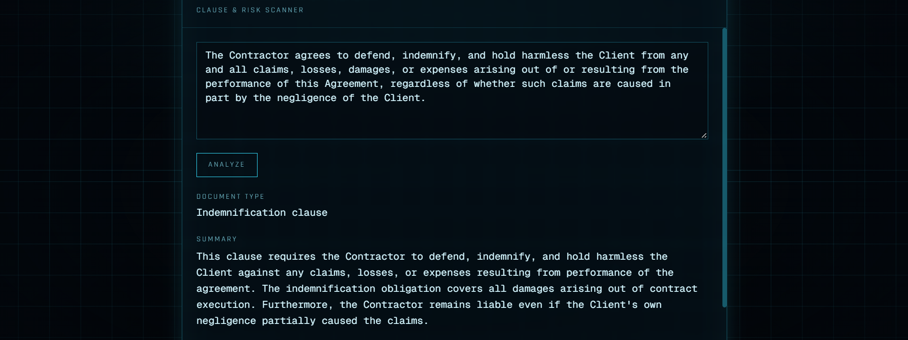
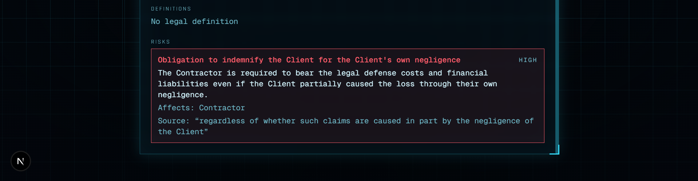

# Legal AI Text Analyzer

A full-stack demo that uses Google's Gemini model to analyze legal text. Paste in a clause or document and it flags risky terms, extracts defined terms, and summarizes the content — returning structured JSON instead of a wall of prose, so the frontend can render it as data (risk badges, a definitions list, citations) rather than just displaying raw model text.

Built as a learning project to practice full-stack LLM integration: prompt design, enforcing a strict JSON contract on model output, and checking the model's claims against the source text instead of trusting them.

> **Disclaimer:** This is a portfolio/learning project, not a legal tool. It does not give legal advice and its output should not be relied on for real legal decisions.

## What it does

- **Text Analyzer** (`/analyze`) — paste any clause or document. Gemini first decides whether the input is actually legal text (it rejects grocery lists, casual text, etc.), then returns:
  - a 3-sentence summary
  - the document type
  - defined terms found in the text
  - flagged risks, each with a severity (`low` / `medium` / `high`), the affected party, and a citation back to the source text
  - **citation verification** — every quoted citation is checked against the original text. Found quotes are highlighted in the document; quotes the model paraphrased or made up are marked "not found" so the user knows not to trust that finding blindly
- **Chat** (`/`) — a HUD-styled chat interface, a second, simpler Gemini integration for comparison.

## Stack

- **Frontend:** Next.js 16 (App Router), React 19, TypeScript, Tailwind CSS
- **Backend:** FastAPI (Python) + the Google Generative AI SDK (Gemini)
- The analyzer prompt enforces a strict JSON schema (see `SYSTEM_PROMPT` in `Backend/main.py`), and the response is validated with Pydantic before it reaches the frontend — a malformed answer (e.g. an invalid `riskLevel`) is rejected instead of breaking the UI.

## Architecture note

All analysis logic lives in the FastAPI service (`Backend/main.py`); the Next.js app is a client that renders its JSON. Citation matching is a separate, dependency-free module (`Backend/citations.py`): it tolerates differences that don't change meaning (case, whitespace, quote marks, an elided `...`) but requires the actual words to match, and returns character offsets so the frontend can highlight the passage.

LLMs are known to produce plausible-looking quotes that aren't in the source. Checking that in code, rather than asking the model to be careful, is the main design point of the project.

## Running locally

**Prerequisites:** Node.js 18+, Python 3.10+, and a free Gemini API key from [aistudio.google.com/apikey](https://aistudio.google.com/apikey).

### 1. Backend (FastAPI)

```bash
cd Backend
python -m venv .venv
.venv\Scripts\activate        # Windows
# source .venv/bin/activate   # macOS/Linux

pip install -r requirements.txt
```

Create `Backend/.env`:

```
GEMINI_API_KEY=your_key_here
```

```bash
uvicorn main:app --reload
```

### 2. Frontend (Next.js)

```bash
cd frontend
npm install
```

Create `frontend/.env.local`:

```
GEMINI_API_KEY=your_key_here
```

```bash
npm run dev
```

Open [http://localhost:3000](http://localhost:3000). The Analyze page expects the FastAPI backend on `http://127.0.0.1:8000`; set `NEXT_PUBLIC_API_URL` in `.env.local` to point it elsewhere. (The key in `.env.local` is only used by the Chat page.)

## Screenshots

Analyzing a one-sided indemnification clause — note the model flags that it makes the Contractor liable even for the Client's own negligence, with a direct citation back to the source text:




